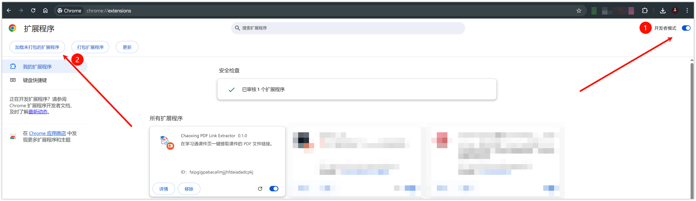
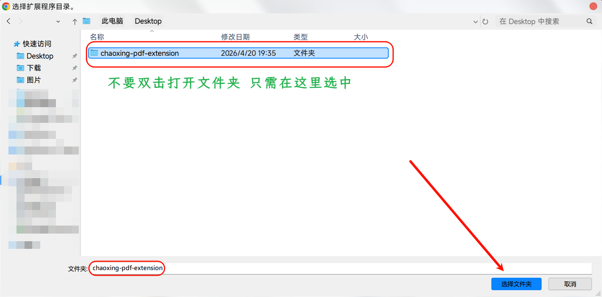
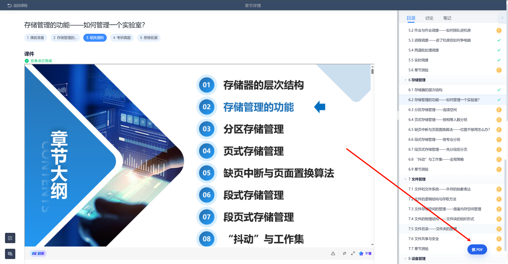
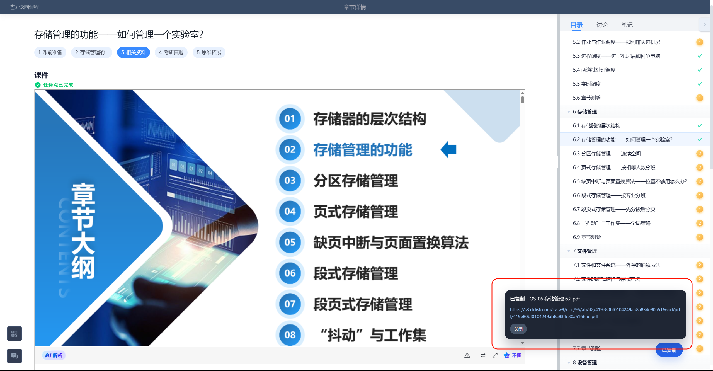
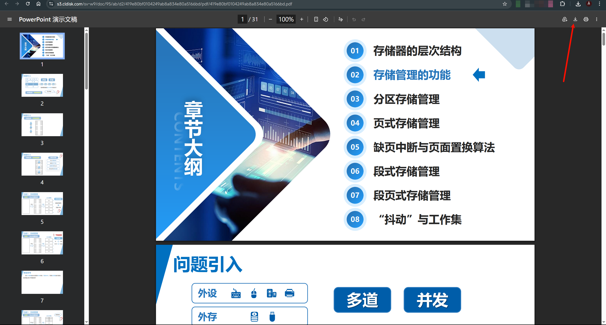

# Chaoxing PDF Link Extractor

一个给学习通用的小工具。

很多用 pad 上课的同学，平时都要下载老师的课件。  
但有的老师没有把课件放在 **课程资料** 里，而放在了 **章节任务** 里面。  
这样想下载的时候就很麻烦。

所以我做了这个工具。

它的作用很简单：

> 在你已经登录学习通、并且已经打开章节里的课件页面时，帮你提取当前课件可访问的 PDF 地址，方便你自己打开和下载。

---

## ✨ Features

- 在学习通课件页面显示一个按钮
- 点击后尝试获取当前课件对应的 PDF 地址
- 成功后自动复制链接到剪贴板
- 同时显示链接，方便手动打开
- 支持 Chrome / Edge（Chromium 内核浏览器）

---

## 🚀 Installation

### Chrome

1. 在Release界面下载 **chaoxing-pdf-extension.zip** 到本地并解压
2. 打开chrome扩展程序界面：

```text
chrome://extensions/
```

3. 打开右上角 **开发者模式**
4. 点击 **加载已解压的扩展程序**
5. 选择当前项目文件夹

---

### Edge

1. 在Release界面下载 **chaoxing-pdf-extension.zip** 到本地并解压
2. 打开：

```text
edge://extensions/
```

3. 打开右上角 **开发者模式**
4. 点击 **加载已解压的扩展**
5. 选择当前项目文件夹

---

## 🧭 How to Use

1. 先登录学习通
2. 打开自己的课程
3. 进入具体章节
4. 打开里面的课件页面
5. 点击页面上的按钮
6. 等待提取结果
7. 成功后会自动复制 PDF 地址
8. 你可以点击地址链接或粘贴到浏览器打开，进行下载

---

## 📸 Screenshots


## 








---

## 📌 适合什么情况

适合这种情况：

- 你已经登录学习通
- 你已经进入自己的课程
- 老师把 PPT / PDF 放在章节任务里
- 你想更方便地拿到课件链接自己打开下载

---

## ⚠️ 注意事项

它有几个前提：

- 你自己必须已经登录学习通
- 你自己本来就能打开这个课程和这个章节
- 你自己本来就有权限访问这个课件页面

如果你没登录，或者课程不是你的，或者页面本来就进不去，那这个工具也没用。

---

## 🛠️ How it works

大概原理很简单：

- 在当前课件页面里寻找和课件相关的信息
- 尝试定位当前课件的 `objectid`
- 请求对应课件状态接口
- 从返回结果里提取可访问的 PDF 地址
- 自动复制到剪贴板并显示出来

这个工具只处理 **当前已打开页面** 对应的课件，不做批量抓取，也不提供登录功能。

---

## ❓ FAQ

### 1. 为什么点了没反应？

先检查这几个地方：

- 你有没有登录学习通
- 你是不是已经打开了具体课件页面
- 扩展有没有正确加载成功
- 页面是不是还没加载完

---

### 2. 为什么提示找不到 PDF？

可能有几种情况：

- 当前打开的不是目标课件页面
- 页面还没加载完整
- 学习通页面结构变了
- 这个课件本身没有可用的 PDF 地址

---

### 3. 为什么安装方式这么麻烦？

因为有些同学不方便访问 Chrome Web Store，  
所以这里提供的是 **手动加载已解压扩展** 的方式。

---

### 4. 更新版本怎么办？

如果仓库更新了，你可以：

1. 下载最新版文件
2. 替换原来的项目文件夹
3. 回到扩展管理页
4. 点击一下扩展卡片上的 **刷新 / 重新加载**

---

## 🧩 Project Structure

```text
chaoxing-pdf-extension/
├─ icons/
├─ content.css
├─ content.js
└─ manifest.json
```

---

## 💡 Why I made this

主要就是因为：

**很多老师会把课件放在章节任务里，而不是课程资料里。**

尤其是平时用 pad 上课的时候，  
想把老师的 PPT / PDF 下载下来并不方便。  
所以就顺手做了这个小工具，方便自己，也顺便分享给有类似需求的同学。

---

## 📝 Disclaimer

这个工具只是一个 **当前页面课件链接提取辅助工具**。

它不会帮你登录学习通，也不会帮你获取你本来没有权限访问的内容。  
请只在你自己有权限访问的课程页面中使用。

---

## 🐞 Feedback

如果你在使用中遇到问题，比如：

- 某些页面提取不到
- 按钮不显示
- 学习通更新后失效

欢迎提 issue。

如果反馈时能附上这些信息，会更容易排查：

- 浏览器版本
- 问题页面截图
- 控制台报错信息（如果会看）
- 是否为 Chrome / Edge

---

## ⭐ Final

这个工具本质上就是为了解决一个很实际的小麻烦。

能帮到你就好。
